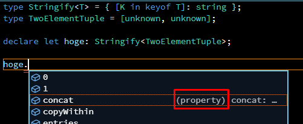
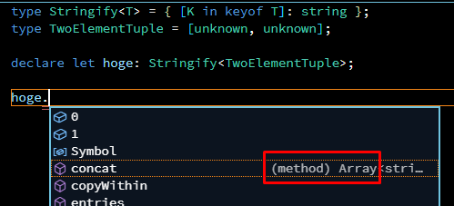

# [TypeScript] 3.1

{{ page.meta.description }}

## [Mapped types on tuples and arrays]

[Mapped types on tuples and arrays]: https://www.typescriptlang.org/docs/handbook/release-notes/typescript-3-1.html#mapped-types-on-tuples-and-arrays

{{label('not_necessary')}} {{label('easy')}}

[mapped types]でArrayやTupleを指定したときの挙動が変わった。  
たとえば以下のコードがあるとする。

```typescript
type Stringify<T> = { [K in keyof T]: string };
type TwoElementTuple = [unknown, unknown];

declare let hoge: Stringify<TwoElementTuple>;
```

TypeScript3.1以前と3.1以降では以下の様に推論される型が異なる。

|                        | 3.1以前                         | 3.1以降       |
| ---------------------- | ------------------------------- | ------------- |
| `[K in keyof T]`の対象 | indexだけでなくmethodなども含む | **indexだけ** |
| `hoge.0`の型           | string                          | string        |
| `hoge.concat`の型      | string                          | **method**    |

[mapped types]の用途を考えれば、methodなどのプロパティは型変換されない方が望ましい。

=== "TypeScript3.0のhogeに対する補完"
    

=== "TypeScript3.1のhogeに対する補完"
    


## [Properties declarations on functions]

[Properties declarations on functions]: https://www.typescriptlang.org/docs/handbook/release-notes/typescript-3-1.html#mapped-types-on-tuples-and-arrays

{{label('had_better')}} {{label('easy')}}

関数のプロパティが宣言できるようになった。  
namespaceの魔法を使わずに名前空間を利用できる。

=== "v3.0以前"
    ```typescript
    function sum(x: number, y: number): number {
      return x + y;
    }
    
    // 同名namespaceを宣言して、その中に関数を定義する必要がある
    namespace sum {
      export const double = (x: number, y: number): number => {
        return 2 * (x + y);
      };
    }

    console.log(sum(1, 2));
    // -> 3
    console.log(sum.double(1, 2));
    // -> 6
    ```

=== "v3.1から"
    ```typescript
    function sum(x: number, y: number): number {
      return x + y;
    }

    // sum.doubleをプロパティとして認識する (3.0以前だとエラー)
    sum.double = (x: number, y: number): number => {
      return 2 * (x + y);
    };

    console.log(sum(1, 2));
    // -> 3
    console.log(sum.double(1, 2));
    // -> 6
    ```

Reactで`defaultProps`を使う場合は知っておくといいかも。


## [Version selection with typesVersions]

[Version selection with typesVersions]: https://www.typescriptlang.org/docs/handbook/release-notes/typescript-3-1.html#version-selection-with-typesversions

{{label('had_better')}} {{label('easy')}}

TypeScriptバージョンごとに異なる型定義ファイルを読み込めるようになった。  
**特定バージョンで追加された型表現を使いつつ、下位互換性も担保したいケース**などに使う。

`package.json`に追加された`typesVersions`プロパティで指定する。

```json
{
  "name": "package-name",
  "version": "1.0",
  "types": "./index.d.ts",
  "typesVersions": {
    ">=3.1": { "*": ["ts3.1/*"] }
  }
}
```

上の設定は以下を意味する。

* v3.1以上なら全てのモジュールに対して、パッケージ名配下の`ts3.1/*.d.ts`を参照する
* それ以外なら全てのモジュールに対して、パッケージ名配下の`*.d.ts`を参照する (いつも通り)


[mapped types]: ../2.1/#mapped-types
