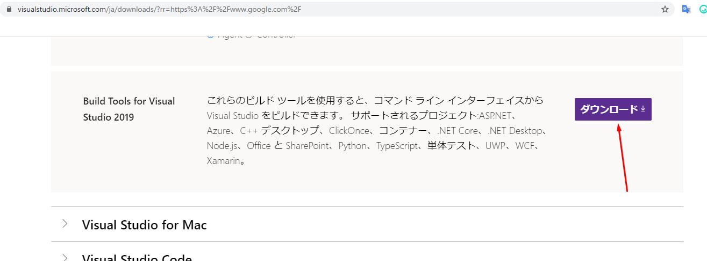

# [The book] 1. Getting Started

{{ page.meta.description }}

{{link("https://doc.rust-lang.org/book/ch01-00-getting-started.html")}}

Rustをインストールして、cargoを使ったpackage管理にチャレンジする。


## [1.1. Installation](https://doc.rust-lang.org/book/ch01-01-installation.html)

### Rustのインストール

Rustのバージョンや関連ツールを管理するCLIツール`rustup`を使う。

`rustup`はScoopでインストールする。

```
$ scoop install rustup
```

本家のサイトは下記。多分Scoopでも同じ事をやっているはず。

{{link("https://www.rust-lang.org/tools/install")}}

#### Windowsの場合

Windowsの場合は`Build Tools for Visual Studio2019`が必要。 (2013以上ならOKなはず)

{{link("https://visualstudio.microsoft.com/ja/downloads/?rr=https%3A%2F%2Fwww.google.com%2F")}}



ダウンロードしたインストーラで必要なのは以下2つだけ。


### Rustのバージョン確認

```
$ rustc --version
rustc 1.45.2 (d3fb005a3 2020-07-31)
```


## [1.2. Hello, World!](https://doc.rust-lang.org/book/ch01-02-hello-world.html)

### ファイルの命名規約

* 拡張子は`.rs`
* 単語の区切り文字はアンダースコア

### main.rsの作成

`main.rs`
```rust
fn main() {
  println!("Hello, world!");
}
```

* インデントはスペース (not タブ)
* `!`を末尾に付けると関数の代わりにマクロを呼び出す
* 文末にはセミコロンをつける

### コンパイル

```rust
$ rustc main.rs
$ ls
 main.exe   main.pdb   main.rs
```

`main.pdb`はデバッグ用の情報(Windowsのみ)。

Rustは`ahead-of-time compiled language`なのでコンパイルと実行は別。

### 実行

```rust
$ ./main
Hello, world!
```


## [1.3. Hello, Cargo!](https://doc.rust-lang.org/book/ch01-03-hello-cargo.html)

Cargoはビルドシステム/パッケージマネージャー。

### バージョン確認

```
$ cargo --version
cargo 1.45.1 (f242df6ed 2020-07-22)
```

### プロジェクトを作成

```
$ cargo new hello_cargo
     Created binary (application) `hello_cargo` package
$ tree -a .\hello_cargo\ -I .git
  ./hello_cargo
├──   .gitignore
├──   Cargo.toml
└──   src
   └──   main.rs
```

Cargoは`src`ディレクトリ配下にソースコードがある想定で動く。  

### ビルド

#### デバッグビルド

```
$ cargo build
   Compiling hello_cargo v0.1.0 (C:\Users\syoum\work\sandbox\rust\thebook\hello_cargo)
    Finished dev [unoptimized + debuginfo] target(s) in 1.24s
```

`target/debug/hello_cargo.exe`と`Cargo.lock`ができる。

#### リリースビルド

`--release`フラグを付ける。

```
$ cargo build --release
   Compiling hello_cargo v0.1.0 (C:\Users\syoum\work\sandbox\rust\thebook\hello_cargo)
    Finished release [optimized] target(s) in 0.40s
```

最適化(optimized)され、デバッグ情報は含まれない。  
`target/release/hello_cargo.exe`と`Cargo.lock`ができる。

成果物作成やベンチマークをとる場合はリリースビルドを使おう。

### ビルド&実行

```
$ cargo run
   Finished dev [unoptimized + debuginfo] target(s) in -1.01s
    Running `target\debug\hello_cargo.exe`
Hello, world!
```

`cargo run`は対象ファイルに変更がないとビルドをスキップする。  
`main.rs`を変更してから実行すると、以下のようにリビルドされる。

```
$ cargo run
   Compiling hello_cargo v0.1.0 (C:\Users\syoum\work\sandbox\rust\thebook\hello_cargo)
    Finished dev [unoptimized + debuginfo] target(s) in 0.37s
     Running `target\debug\hello_cargo.exe`
Hello, takuya!
```

### コンパイルできるかのチェック

```
$ cargo check
    Checking hello_cargo v0.1.0 (C:\Users\syoum\work\sandbox\rust\thebook\hello_cargo)
    Finished dev [unoptimized + debuginfo] target(s) in 0.11s
```

`cargo build`より高速なので、定期実行に適している。

### 🦉 TypeScriptとの比較。

| Rust        | TypeScript        |
| ----------- | ----------------- |
| Cargo.toml  | package.json      |
| Cargo.lock  | package-lock.json |
| target      | dist              |
| cargo build | tsc main.ts       |
| cargo run   | node main.js      |
| cargo check | ???               |
